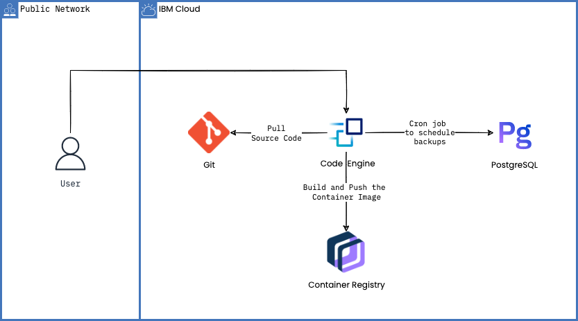

# Automate PostgreSQL backup with IBM Cloud Code Engine

Learn how to build a container image from source code and use the image to schedule your PostgreSQL backups using IBM Cloud Code Engine. 




## Instructions 

Follow the steps in the [blog post here](https://www.ibm.com/cloud/blog/automate-postgresql-backups-with-ibm-cloud-code-engine)

## To test locally

1. Clone the repo and move to the folder 
    ```
    git clone https://github.com/VidyasagarMSC/automate-postgresql-backup

    cd automate-postgresql-backup
    ```
2. Set the environment variables `IBM_CLOUD_API_KEY` and `POSTGRES_DEPLOYMENT_ID` on a terminal or command prompt
  
   ```sh
   IBM_CLOUD_API_KEY="<IBM CLOUD API KEY>"
   POSTGRES_DEPLOYMENT_ID="<POSTGRESQL service CRN (DEPLOYMENT ID)
   ```
3. Run the below command 
   ```sh
   python backup.py
   ```

  